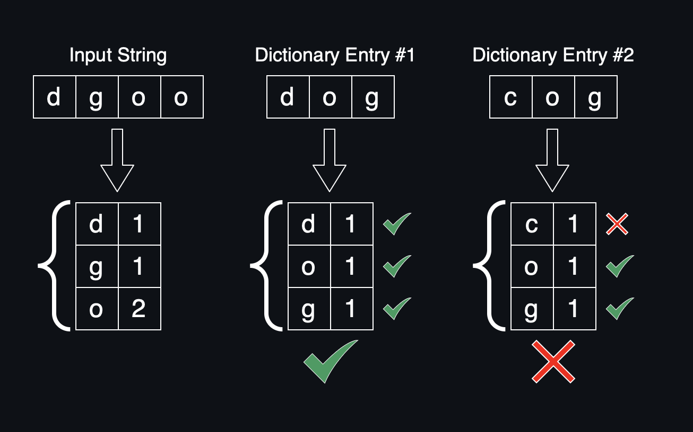

# Weekend Health Take Home

## Problem Statement

Given a string $S$ and array of strings $A$, return all elements of $A$ such that each element can be formed of a partial rearrangement of the characters in $S$.

## Approach



It is true that "$S_1$ is a partial rearrangement of $S_2$" is equivalent to $\forall c \in S_1: \text{Count}[c, S_1] \leq \text{Count}[c, S_2]$, i.e. that the _count_ of each character in $S_1$ is less than or equal to the count of that character in $S_2$.

Our approach is a direct translation of the above method, by memoizing the count of $S$ across invocations using a closure. This results in a computational time complexity of $O(|A|)$.

## Automated Testing

Automated tests, configured with Jest can be ran via `npm test`.

## Source Annotation

The solution is separated into methods, `canBeRearranged(x, y)` and `findWords(s, dict)`.

### `canBeRearranged`

`canBeRearranged` is a function that takes in a corpus and input string. The corpus represents the amount of copies available for each character. The implementation uses `countBy`, which when invoked on a string converts the string into a hashmap of the number of instances of each character.

```ts
const canBeRearranged = (corpus: Record<string, number>, b: string) =>
  every(countBy(b), (amt, key) => (corpus[key] ?? 0) >= amt);
```

### `findWords`

`findWords` is a simple filtering over `dict` such that each element can be formed of a partial rearrangement of `input`.

```ts
export const findWords = (input: string, dict: string[]) =>
  dict.filter((x) => canBeRearranged(countBy(input), x));
```

## Utility Methods

We additionally provide an implementation of the two utility methods `countBy` and `every`:

```ts
const countBy = (s: string): Record<string, number> =>
  [...s].reduce((obj, c) => ({ ...obj, [c]: obj[c] ?? 0 + 1 }), {});

const every = <T>(obj: Record<string, T>, f: (x: T, key: string) => boolean) =>
  Object.entries(obj).every(([key, value]) => f(value, key));
```
